<div align="center">

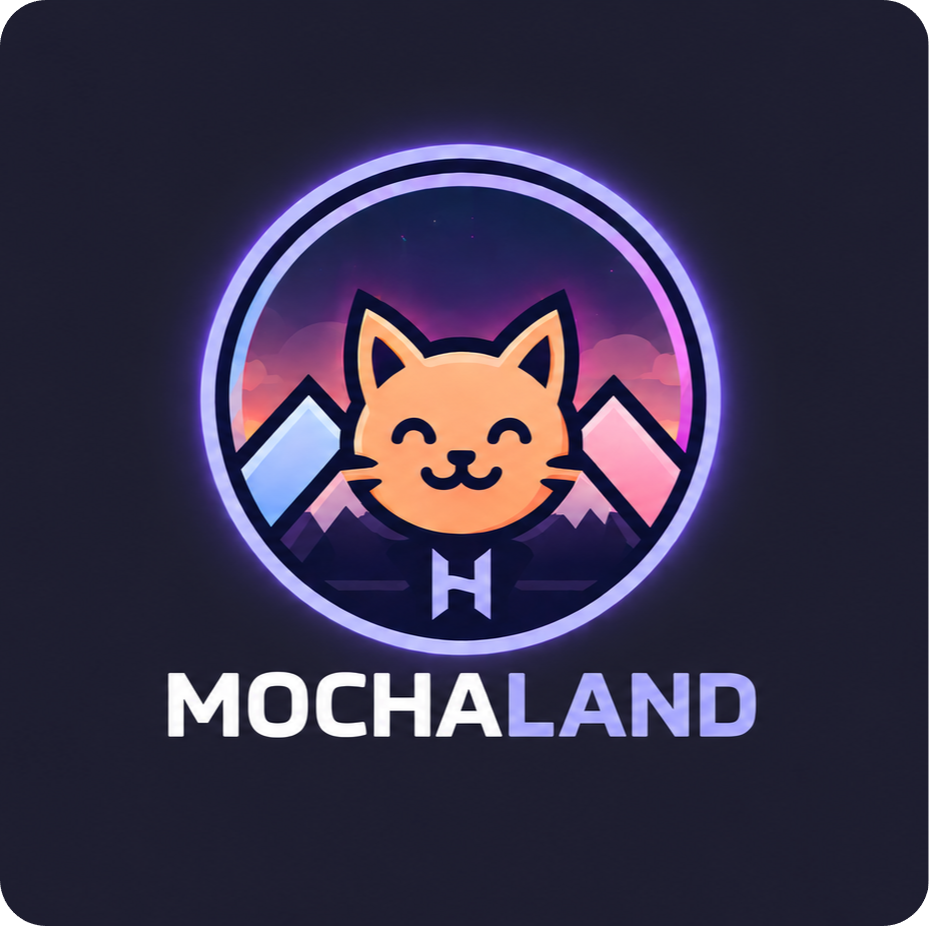

### Hyprland · Catppuccin Mocha · Keyboard-Focused Workflow

 &nbsp;
 &nbsp;

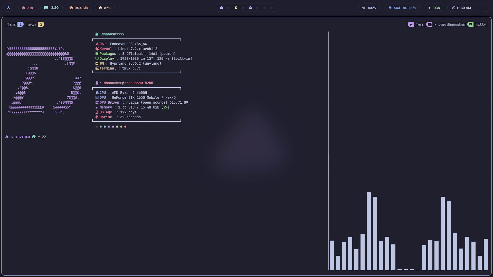

</div>

---

## About

This repository contains my personal Hyprland dotfiles, built with a strong focus on simplicity, consistency, and keyboard-driven productivity. The setup is intentionally minimal, removing unnecessary complexity while keeping everything fast, predictable, and easy to use.

It is designed around a single cohesive theme - Catppuccin Mocha. Rather than supporting multiple themes, everything is tailored specifically for this palette to maintain visual consistency across the entire system. This keeps the configuration lean and avoids the overhead of theme switching.

The workflow is heavily keyboard-centric. Almost every interaction - window management, application launching, media control, network management, and power options - is accessible without relying on a mouse or trackpad.

This setup prioritizes:

- **Speed** - minimal overhead, quick response
- **Consistency** - unified look and behavior across tools
- **Efficiency** - everything reachable from the keyboard

---

## Highlights

- **Single theme** - Catppuccin Mocha only. No theme-switcher overhead, no extra assets.
- **Keyboard-first** - the entire workflow is designed to minimize mouse usage. Window management, launching apps, media controls, Network Management, power options - all on the keyboard.
- **Lua configuration** - modern Hyprland Lua format (`hyprland.lua`) for better organization, readability, and maintainability.
- **Waybar** - custom-styled status bar with workspace indicators, system tray, and volume controls.
- **Keybindings viewer** - press `Super + Alt + /` to open a searchable keybindings viewer. Browse and search all shortcuts without digging through config files.
- **Quality-of-life scripts** - clipboard manager, wallpaper selector, brightness/volume controls, and more.

---

## Keybindings

Don't want to dig through config files? Just press:

```
Super + Alt + /
```

This opens a searchable keybindings viewer - you can browse and search all shortcuts from there.

---

## Installation

> **Requires an Arch-based system.**  
> Do **not** run as root.

```bash
git clone https://github.com/dhanush777x/MochaLand.git ~/.config/MochaLand
cd ~/.config/MochaLand
bash install/install.sh
```

The installer will walk you through everything interactively. Here's what it does:

- Optionally adds **Chaotic-AUR** for faster AUR package builds
- Installs and configures **yay** (AUR helper)
- Installs all required packages
- Backs up your existing configs (nothing gets deleted)
- Deploys configs via symlinks
- Enables NetworkManager, Bluetooth, and PipeWire services
- Sets **Zsh** as your default shell
- Applies Catppuccin Mocha theme

> - Your existing configs are backed up to `~/.dotfiles_backup/<timestamp>` - not deleted.
> - Add your wallpapers to `~/.config/hypr/wallpapers/` after installation.

---

## Stack

| Component            | Tool                          |
| -------------------- | ----------------------------- |
| Window Manager       | Hyprland                      |
| Status Bar           | Waybar                        |
| Launcher             | Rofi                          |
| Notifications        | Dunst                        |
| Terminal             | Kitty                         |
| Shell                | Zsh                           |
| Editor               | Neovim (LazyVim)              |
| File Manager         | Yazi (TUI) / Nautilus (GUI)   |
| Lockscreen           | Hyprlock                      |
| Music                | MPD + ncmpcpp                 |
| Clipboard            | Clipcat                       |
| Theme                | Catppuccin Mocha              |
| Icons                | Papirus-Dark                  |
| GTK Theme            | Colloid-Dark-Catppuccin       |
| Cursor               | Qogir-dark                    |

---

## Preview

<p align="center">
  <span style="display:inline-block; width:45%; text-align:center;">
    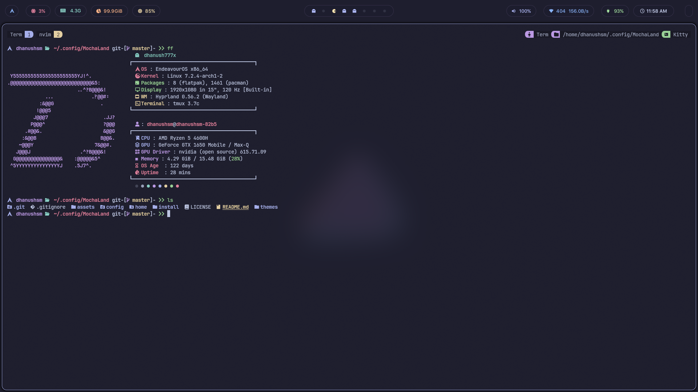<br/>
    <em>Terminal</em>
  </span>
  <span style="display:inline-block; width:45%; text-align:center;">
    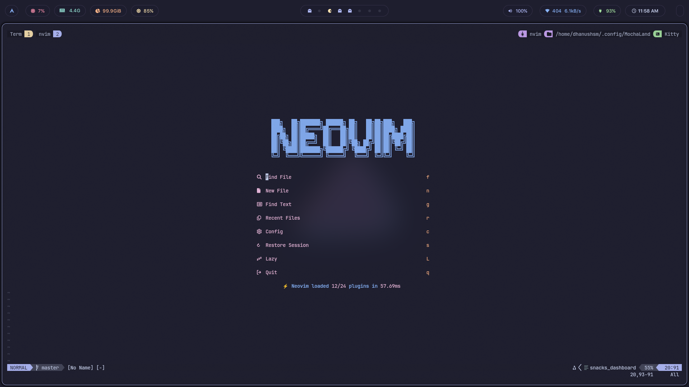<br/>
    <em>Neovim</em>
  </span>
</p>

<p align="center">
  <span style="display:inline-block; width:45%; text-align:center;">
    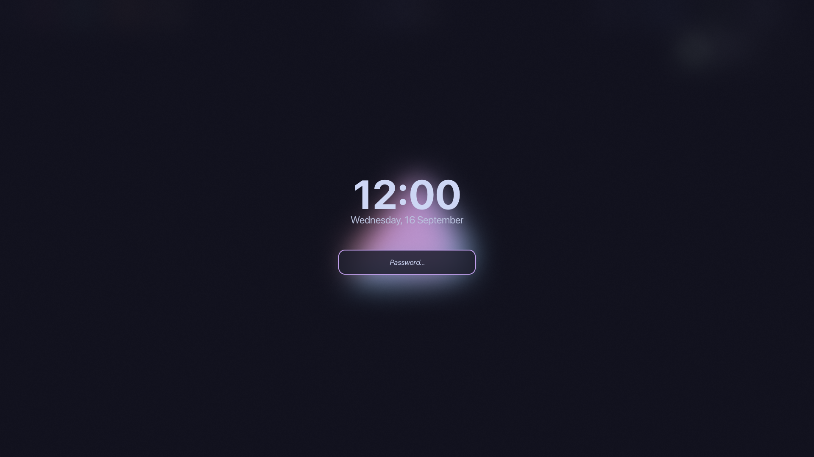<br/>
    <em>Lockscreen</em>
  </span>
  <span style="display:inline-block; width:45%; text-align:center;">
    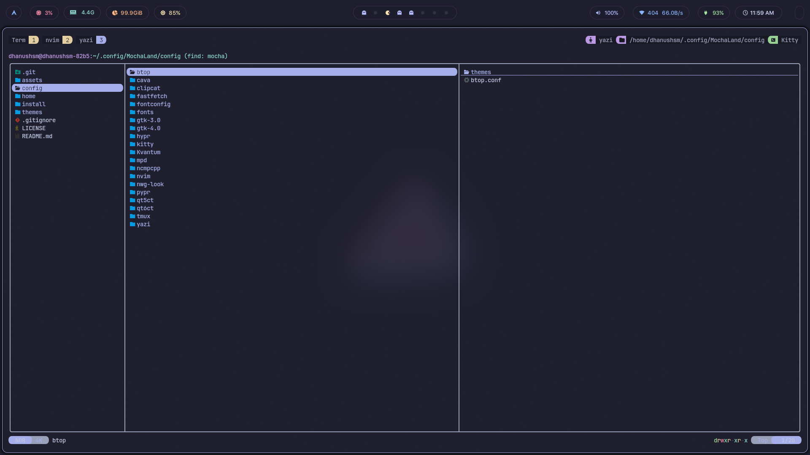<br/>
    <em>File Manager (Yazi)</em>
  </span>
</p>

<p align="center">
  <span style="display:inline-block; width:45%; text-align:center;">
    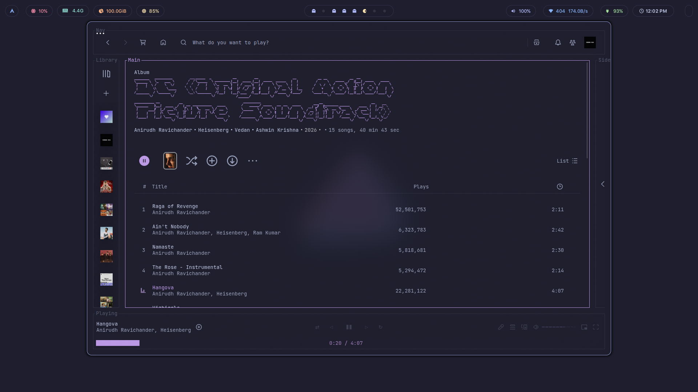<br/>
    <em>Spotify</em>
  </span>
  <span style="display:inline-block; width:45%; text-align:center;">
    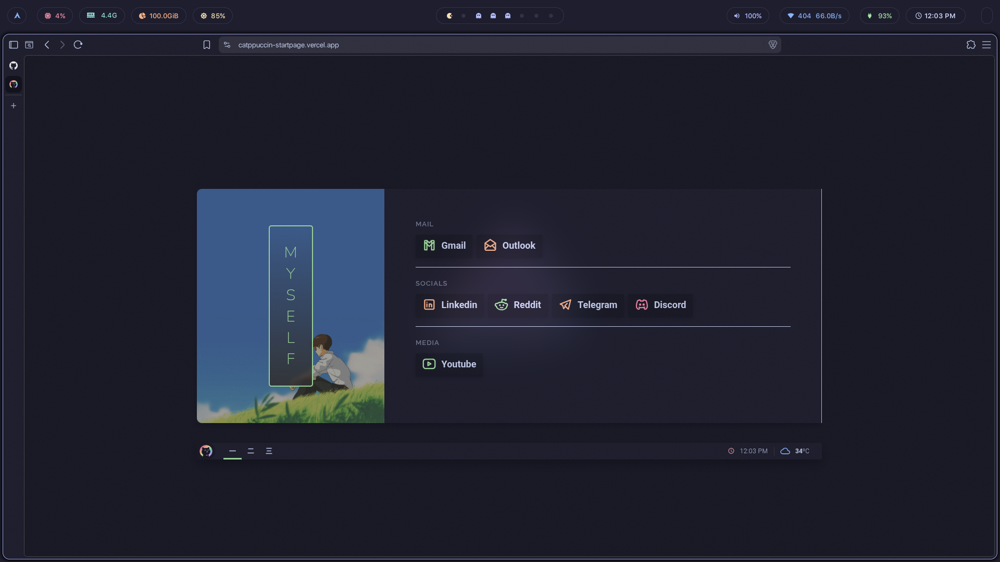<br/>
    <em>Browser (Brave)</em>
  </span>
</p>

---

## Rofi Menus

<p align="center">
  <span style="display:inline-block; width:30%; text-align:center;">
    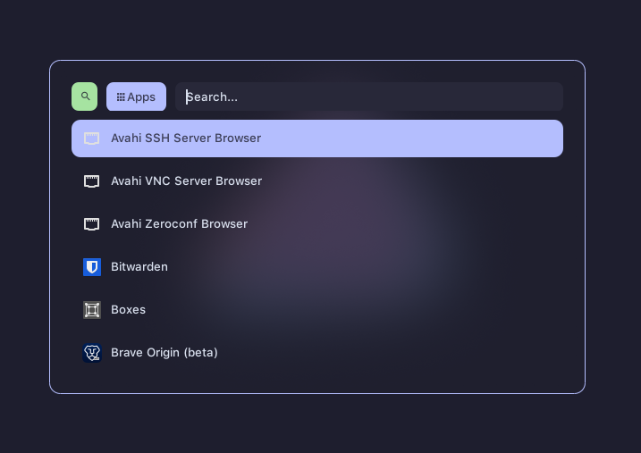<br/>
    <em>Application Launcher</em>
  </span>
  <span style="display:inline-block; width:30%; text-align:center;">
    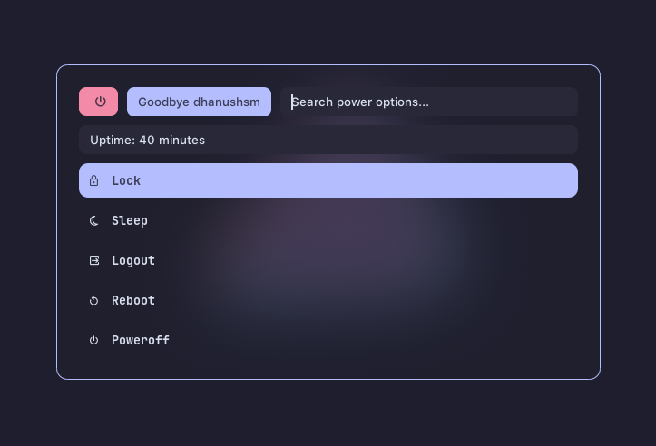<br/>
    <em>Power Menu</em>
  </span>
  <span style="display:inline-block; width:30%; text-align:center;">
    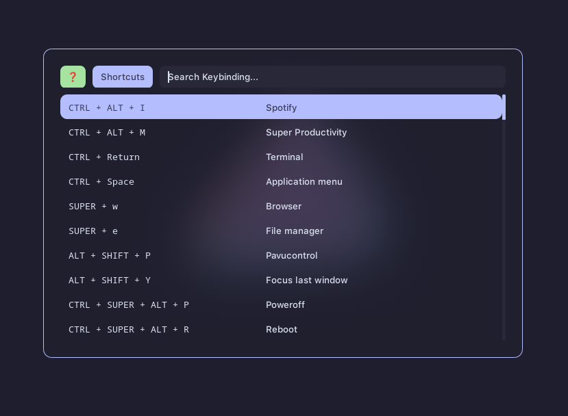<br/>
    <em>Keybindings Viewer</em>
  </span>
</p>

<p align="center">
<span style="display:inline-block; width:30%; text-align:center;">
    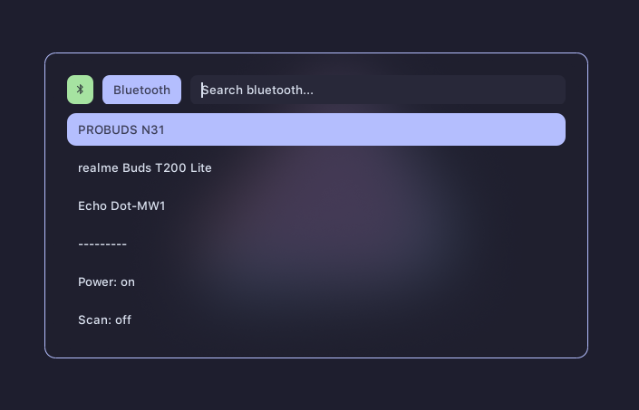<br/>
    <em>Bluetooth</em>
  </span>
<span style="display:inline-block; width:30%; text-align:center;">
    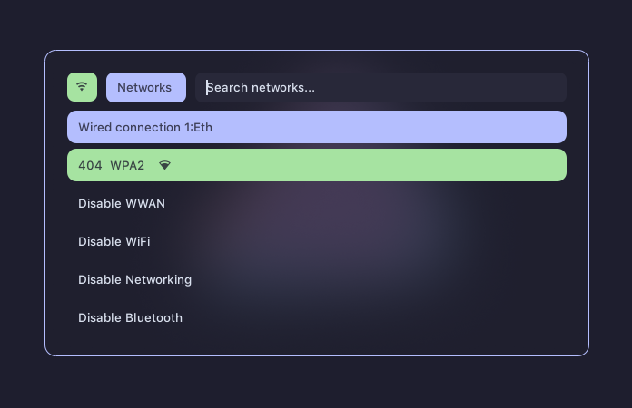<br/>
    <em>Network Manager</em>
  </span>
  <span style="display:inline-block; width:30%; text-align:center;">
    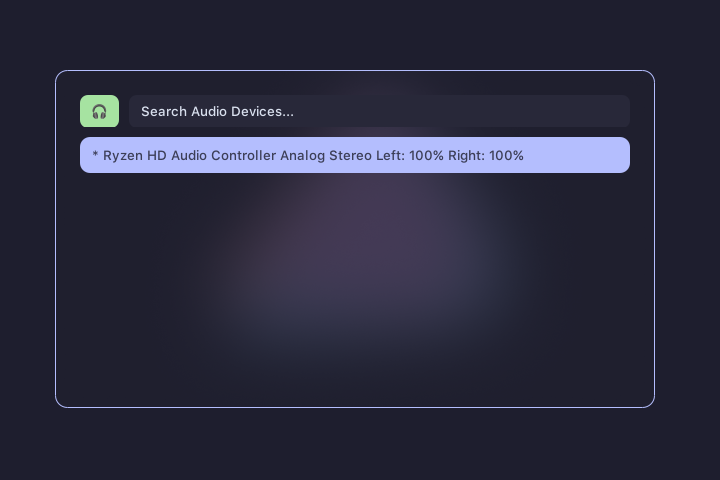<br/>
    <em>Audio Mixer</em>
  </span>
</p>

<p align="center">
  <span style="display:inline-block; width:30%; text-align:center;">
    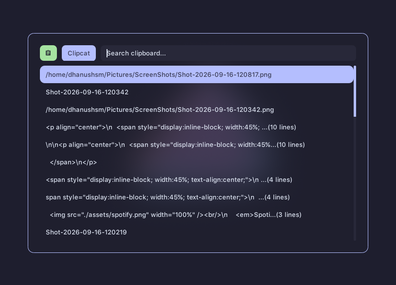<br/>
    <em>Clipboard Manager</em>
  </span>
  <span style="display:inline-block; width:30%; text-align:center;">
    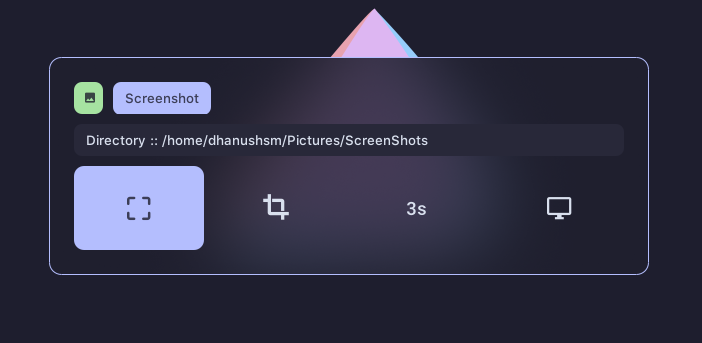<br/>
    <em>Screenshot</em>
  </span>
  <span style="display:inline-block; width:30%; text-align:center;">
    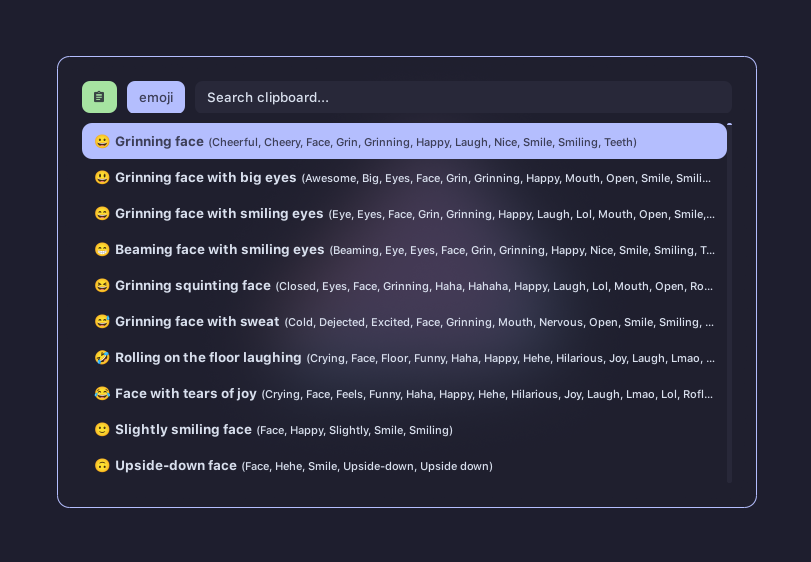<br/>
    <em>Emoji Selector</em>
  </span>
</p>

---

## Contributing

If you encounter any issues or have suggestions for improvements, feel free to open an issue or submit a pull request.

## Credits

- **[gh0stzk](https://github.com/gh0stzk/)** - Scripts adapted from his dotfiles. If you're looking for a feature-rich, multi-theme bspwm setup, definitely check out his repository.
- **[Catppuccin](https://github.com/catppuccin/catppuccin)** - The color palette behind MochaLand.
- **[Colloid](https://github.com/vinceliuice/Colloid-gtk-theme)** - GTK theme base.

## License

[MIT](LICENSE)
